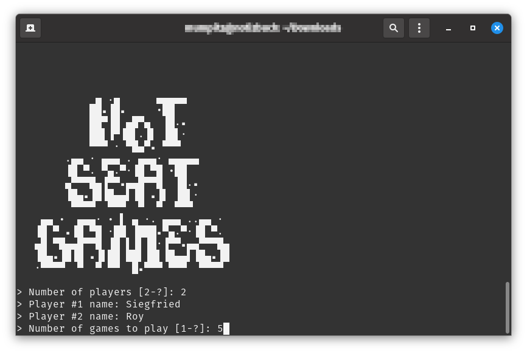

# 🕹 Hot Seat Games

A simple CLI Minigames engine. Created as a Java learning project for the students of my programming class at the [_Institute for Digital Humanities_](https://github.com/DH-Cologne) ([University of Cologne](https://uni-koeln.de/)).

## How to play

Open the project in your Java IDE and run it (for development). **OR** use your IDE (or your hacker skills and `javac` 🤓) to create a runnable `.jar` file from the project and run it with `java -jar HotSeatGames.jar`!

## How to add new games

If you want to add new games, just follow these steps:

1. Create a package with your game's name under `idh.hotseatgames.games` (e.g. `idh.hotseatgames.games.mygame`).
2. Create a game class (preferrably matching your packages name, e.g. `MyGame`) inside this package. This game class must implement the `IGame` interface correctly to work with _Hot Seat Games_. You are free to use the very helpful utility classes in `idh.hotseatgames.utils` ([have a look](https://github.com/bkis/HotSeatGames/tree/main/src/idh/hotseatgames/utils)!). Everything else is up to you.
3. Add your game package and class name to the static array `GAMES_SUB_PATHS` in the `GameManager` class to "register" your game with the engine.

**✨ You are welcome to [contribute your games to this repository](https://guides.github.com/activities/forking/)!**